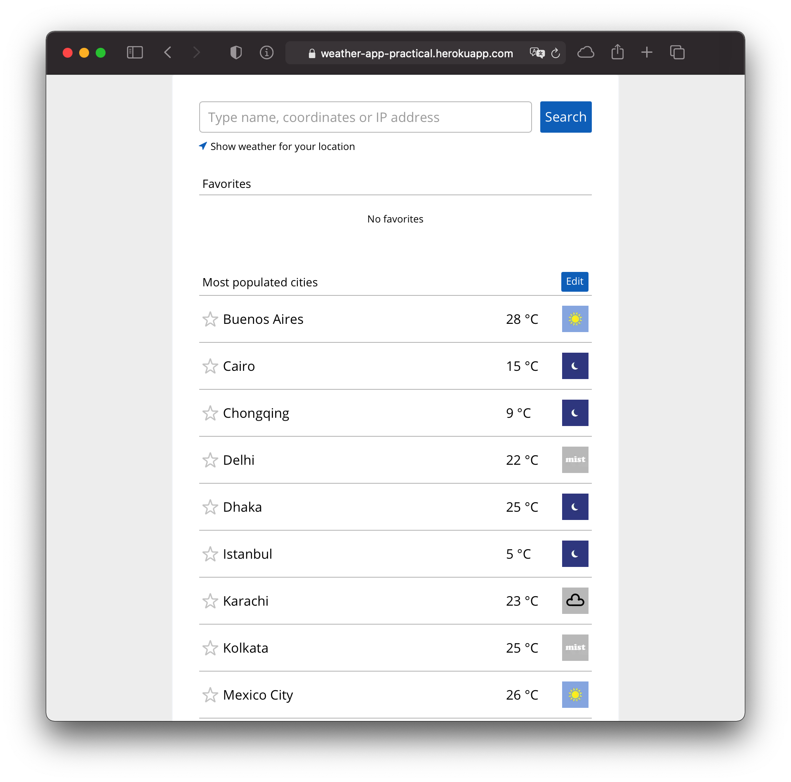

# Weather app

This is completed test assignment. It was bootstrapped with [Create React App](https://github.com/facebook/create-react-app).

Based on React, React Router, Redux, SCSS, i18next. For unit testing added Jest, Enzyme, redux-mock-store, @wojtekmaj/enzyme-adapter-react-17

## Available Scripts

Before start project locally, install all dependencies. Type `npm i` in project root. Then, you need to pass access key for using https://weatherstack.com/ API. There are 2 ways to pass it:

- Directly via env var `API_ACCESS_KEY` (Useful for production env)
- Run `npm run prepare` and find `src/api/config.json`.

In the project directory, you can run:

### `npm start`

Runs the app in the development mode.
Open [http://localhost:3000](http://localhost:3000) to view it in the browser.

The page will reload if you make edits.
You will also see any lint errors in the console.

### `npm test`

Launches the test runner in the interactive watch mode.

### `npm run build`

Builds the app for production to the `build` folder.
It correctly bundles React in production mode and optimizes the build for the best performance.

The build is minified and the filenames include the hashes.

### `npm run lint`

Useful for finding warnings and errors.

### `npm run format`

This command fixes code styles.

## Important notes

You can use city suggestion feature. Based on Weatherstack Autocomplete feature. But it's available only for **Standard plan** and higher. So if you want to run this app for ex. locally, you should upgrade your plan.

For more information you can visit https://weatherstack.com/documentation#location_lookup

## Demo

You can visit https://weather-app-practical.herokuapp.com/ to see how this app works in production mode.

## Screenshots

Note: if you want to see old screenshots (before issues fixing), open `images/old` folder (or click [here](images/old))

